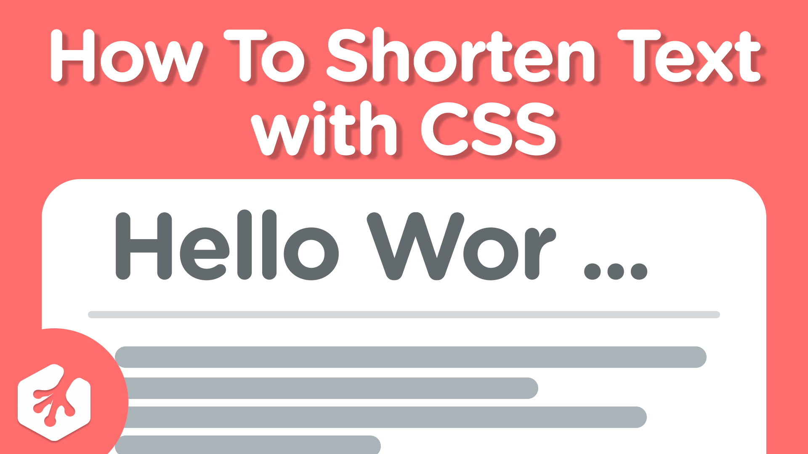
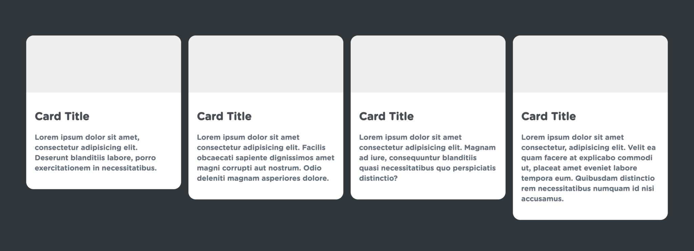
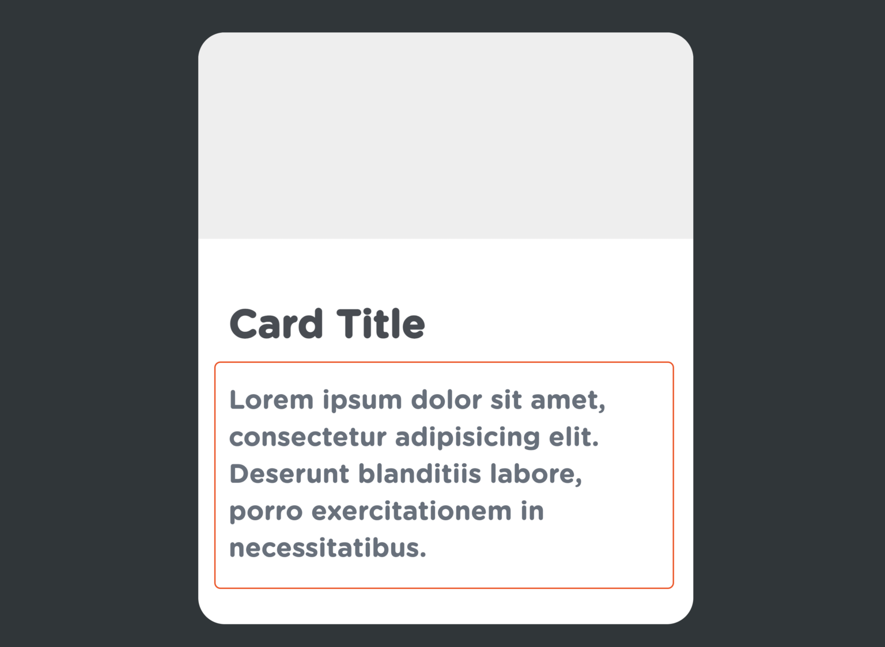
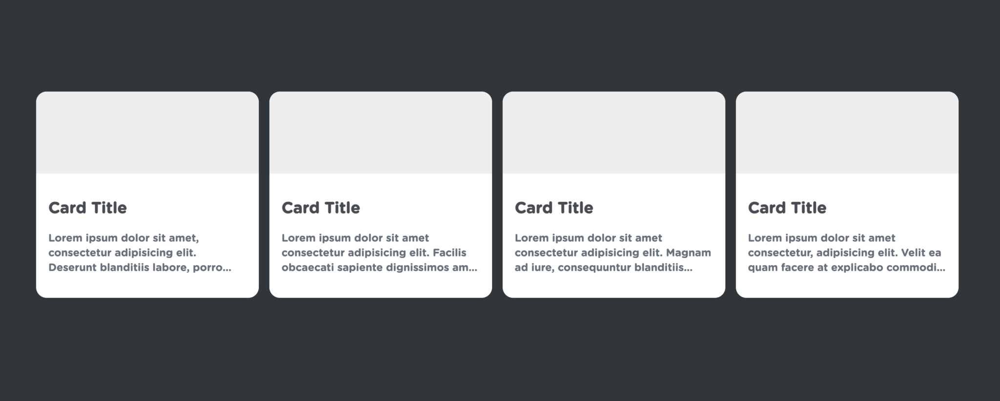

# shorten-text-css

Ever wondered how to shorten text with an ellipsis? It’s quite easy to do and only requires a few lines of CSS. Follow along as I take you through setting this up!



Before we get started, it’s important to note that in order for this to work we need to make sure we’re targeting our text’s direct tag and not its parent or container. Consider the following HTML:

```
<ul>
   <li>
      <p>Hello World!</p>
   </li>
</ul>
```

If you were to target the `<li>` element, this would not work. Instead, target the `<p>` element.

## Getting Started

Let’s assume we’re building out a simple UI with some card elements. Here is what it looks like:



As you can see, each card has a different height due to the amount of text content that is within it. This can make for an inconsistent looking UI. If we wanted to make sure each card had the same amount of lines of text we could make sure the cards all looked consistent. How could we do this?

## CSS Ellipsis

In our stylesheet, let’s target the paragraph tag containing the text content.



We can start by adding a `display` property with the value of `-webkit-box.` This isn’t something you’ll see very often but what this does is it packs its contents in the direction of its layout. This effect is only visible if there is extra space in its container.

```
p.card-description {
   display: -webkit-box;
}
```

Next, we’ll want to add a `text-overflow` property with the value of `ellipsis`. This will give us our three dots (…) at the end of our text to show that there is more text but it’s hidden.

```
p.card-description {
   display: -webkit-box;
   text-overflow: ellipsis;
}
```

Then we can add `overflow: hidden.` This hides the extra content we don’t want to show to the user.

```
p.card-description {
   display: -webkit-box;
   text-overflow: ellipsis;
   overflow: hidden;
}
```

We can next add in `-webkit-box-orient: vertical`.

```
p.card-description {
   display: -webkit-box;
   text-overflow: ellipsis;
   overflow: hidden;
   -webkit-box-orient: vertical;
}
```

Last, and most important, we can add the `-webkit-line-clamp` property. This takes in a numerical value. This value is the amount of lines that we want visible to the user. If by default your paragraph generates 10 lines of text but you only want to show 3, you would write: `-webkit-line-clamp: 3`.

```
p.card-description {
    display: -webkit-box;
    text-overflow: ellipsis;
    overflow: hidden;
    -webkit-box-orient: vertical;
    -webkit-line-clamp: 3; /* this can be any value you want */
}
```

With the above code, our UI now looks like this:



A much more clean, consistent look!

<br><br>

Please make sure you use this feature only when it is necessary. You surely wouldn’t want to hide any important content to the end-user. That being said, with just a little bit of JavaScript, you could add a “Read More” toggle button to turn on and off this feature as needed. If that’s something you’d like to see, be sure to let us know!

One way to make this even simpler is if you were to set up an SCSS mixin. Let me show you how we can turn this into a reusable chunk of code with SCSS mixins.

First, make sure you’re using an SCSS partial and create a new mixin. We can call it `text-overflow`.

```
@mixin text-overflow { 
}
```

We can give it one argument. Which will be the number of lines we want our mixin to show. We’ll call it `$lines`.

```
@mixin text-overflow($lines) {
}
```

We can give it the `@content` property and then add in all of our code from earlier.

```
@mixin text-overflow($lines) {
   @content;
   display: -webkit-box;
   text-overflow: ellipsis;
   overflow: hidden;
   -webkit-box-orient: vertical;
   -webkit-line-clamp: 3;
}
```

We will change the last line (`-webkit-line-clamp`) to use our argument.

```
@mixin text-overflow($lines) {
   @content;
   display: -webkit-box;
   text-overflow: ellipsis;
   overflow: hidden;
   -webkit-box-orient: vertical;
   -webkit-line-clamp: $lines;
}
```

Now, we can just call our mixin whenever we need to and give it the amount of lines we want to show as a parameter. Simple! Here are some examples:

```
p.card-description {
   @include text-overflow(3);
}

.container h1 {
   @include text-overflow(1);
}

.information li p {
   @include text-overflow(5);
}
```

Remember, always target the text’s direct tag and not its parent or container when adding these style properties.

If you’ve never seen SCSS before or want a refresher, take a look at these courses below where we go over this in much more detail. SCSS is a great way to write your CSS and can offer many benefits.

<br>

Sass Basics - 
<a href="https://teamtreehouse.com/library/sass-basics-2">https://teamtreehouse.com/library/sass-basics-2</a>

CSS to Sass - 
<a href="https://teamtreehouse.com/library/css-to-sass">https://teamtreehouse.com/library/css-to-sass</a>

Modular CSS with Sass - 
<a href="https://teamtreehouse.com/library/modular-css-with-sass">https://teamtreehouse.com/library/modular-css-with-sass</a>
